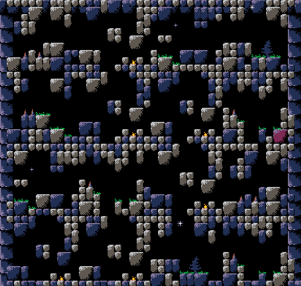

# Random Level Generator Platform 2D

Welcome! This repository was created with the purpose of creating a game and at the same time building Unity Packages that can be used in other projects, thus facilitating and speeding up the development of some games in the future.

## Project overview

1. Assets/LevelGenerator/Prefabs/ Directory containing prefabs that are used to create random levels, for example, Ground, Roons and Room Templates.
2. Assets/LevelGenerator/Scripts/LevelGenerator/ Directory containing scripts related to the creation of random levels.
3. Assets/LevelGenerator/Sprites/ [Free Pico 8 Pixel Art tiles](https://s4m-ur4i.itch.io/pico-8-pixelart-free-tiles)
4. Example

## Unity Packages "Finished"

1. Random Level Generator Plataform 2D

The random generation of the levels is done similar to the one used in the Spelunky game. Prefabs are created with different Rooms, which are instantiated and made available in the form of 4 horizontal lines by 4 vertical lines. 
    
   
    
## Todo next

1. Environment Particulate System  (ex: Rain, Wind, Fog, water).
2. light shadow unity 2d.
3. Player movements and skills (eg: Move, Jump, Slide, Dash, Attack).
4. Audio.

## Random Platformer Level LevelGenerator V01

Scene Structure:
Main (Scene)
    LevelGenerator (Prefab)
    Grid (Prefab)
    

## Project Structure:
Assets \
    LevelGenerator \
        Prefabs \
            Grid \
                Grid
            Ground \
                Ground
            Room Templates \
                RL Room Template
                RLB Room Template
                RLT Room Template
                RLTB Room Template
            Rooms \
                Room RL
                Room RLB
                Room RLT
                Room RLBT
            LevelGenerator
        Scripts \
            LevelGenerator \
                LevelGenerator
                RoomType
                SpawnObjetct
                SpawnRooms
        Assets \

## Dependencias: 

